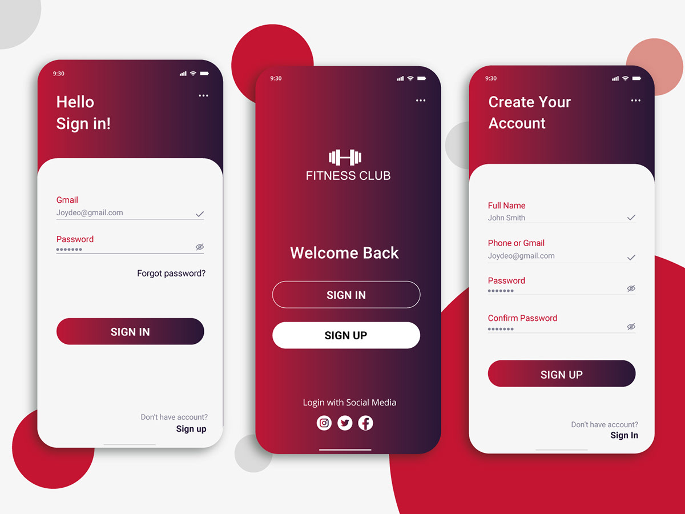
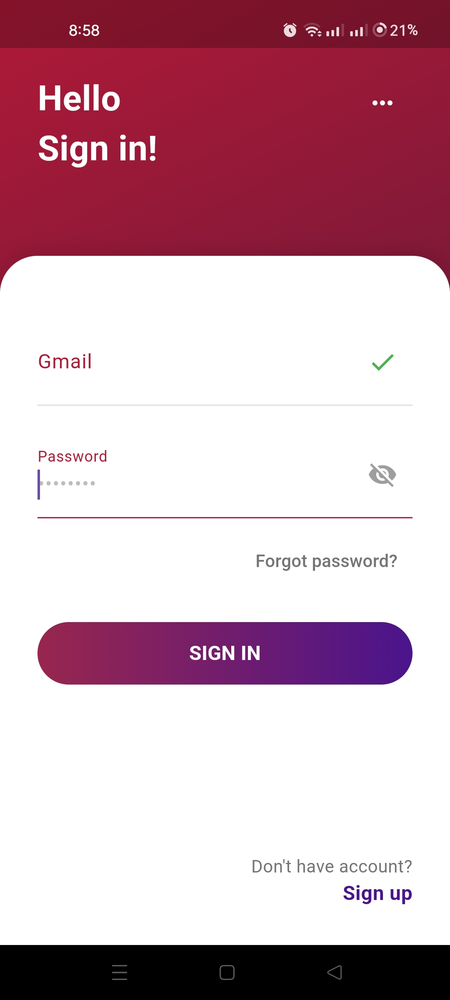
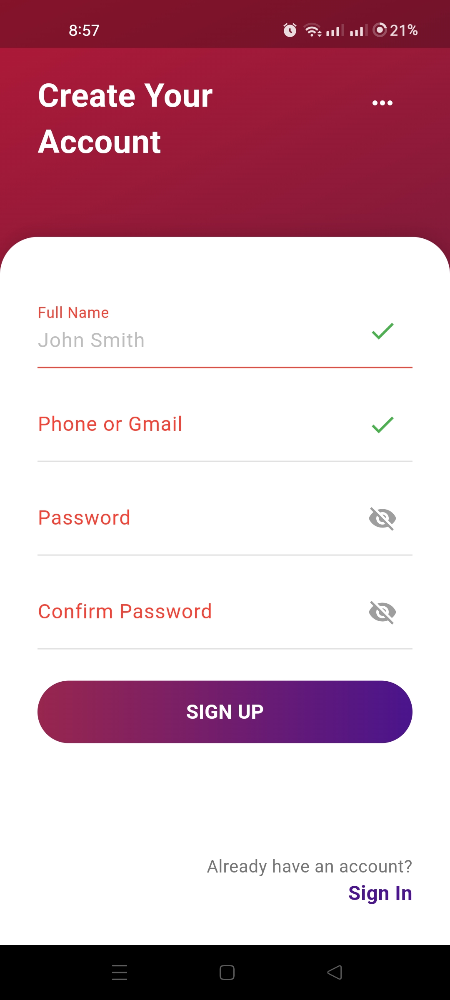
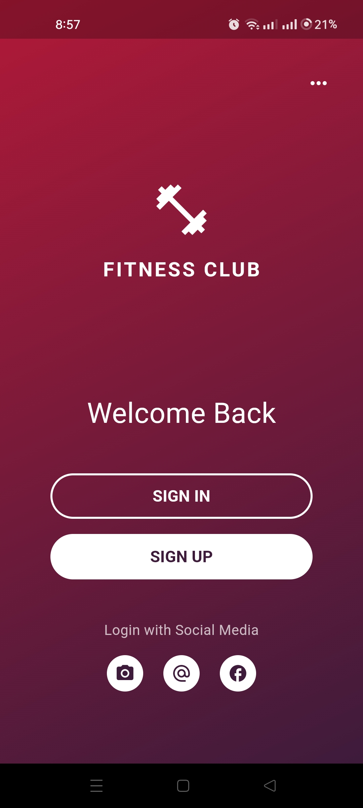

# 💰 Flutter Finance UI

[](https://flutter.dev)
[](https://dart.dev)
[]()
[](https://opensource.org/)
[](LICENSE)

---

## 🧠 Overview

**Flutter Finance UI** is a **user interface template** specifically designed for **finance and banking applications** built with **Flutter**.
It offers a **modern, clean, and intuitive design**, serving as a great starting point for developers who want to learn or practice UI design for fintech apps.

This project is **beginner-friendly** and demonstrates **real-world Flutter layout practices**, responsive design techniques, and component-based architecture.

---

## 🎬 Intro

<div align="center">
  
  
    
</div>

## ✨ Features

* 💵 **Modern Finance Dashboard** — Elegant screens tailored for finance and analytics apps.
* 📊 **Statistics & Charts** — Visualize data using clean, intuitive charts and widgets.
* 🌗 **Light & Dark Mode** — Seamless theme switching for better usability.
* ⚡ **Responsive Design** — Works flawlessly across different devices and screen sizes.
* 🧩 **Clean Code Structure** — Easy to read, modify, and extend.

---

## 📸 Screenshots

<div align="center">
  <table>
    <tr>
      <td></td>
      <td></td>
      <td></td>
    </tr>
  </table>
</div>

---

## 🎥 Demo Video

Watch the **Flutter Finance UI** demo on **X :**
👉 [Watch the Demo Here](https://x.com/KishanP07684084/status/1949490256656609606)

---

## 🏗️ Tech Stack

| Technology          | Description                                                |
| ------------------- | ---------------------------------------------------------- |
| **Flutter**         | Cross-platform UI toolkit for building beautiful apps      |
| **Dart**            | Programming language used in Flutter development           |
| **Material Design** | Framework for consistent UI/UX design                      |
| **Custom Widgets**  | Modular components for charts, cards, and finance elements |

---

## ⚙️ Installation & Setup

Follow these steps to set up and run the project locally:

### 1️⃣ Clone the Repository

```bash
git clone https://github.com/<your-username>/flutter-finance-ui.git
cd flutter-finance-ui
```

### 2️⃣ Install Dependencies

```bash
flutter pub get
```

### 3️⃣ Run the App

```bash
flutter run
```

---

## 💡 Learning Outcomes

By exploring this project, you’ll learn:

* How to design and structure a **Flutter UI for finance apps**
* Techniques for creating **responsive dashboards and charts**
* Effective use of **themes, colors, and typography**
* Modular design principles for **scalable Flutter projects**

---

## 🤝 Contributing

Contributions are always welcome! To get started:

1. Fork the repository
2. Create a new branch (`git checkout -b feature/your-feature`)
3. Commit your changes (`git commit -m 'Add a new feature'`)
4. Push to the branch (`git push origin feature/your-feature`)
5. Open a Pull Request

---

🧠 Flutter Development Environment Setup

This project is built using Flutter. Below are the essential details and configuration requirements for replicating the development environment.

| Component              | Details                                      |
| ---------------------- | -------------------------------------------- |
| **Flutter Version**    | 3.27.1 (Stable Channel)                      |
| **Framework Revision** | 17025dd882                                   |
| **Engine Revision**    | cb4b5fff73                                   |
| **Dart Version**       | 3.6.0                                        |
| **DevTools Version**   | 2.40.2                                       |
| **Operating System**   | Windows 10 (Version 10.0.26200.6725, 64-bit) |
| **Locale**             | en-US                                        |


💻 Android Studio

* Version: 2023.3
* Java Runtime: OpenJDK 17 (17.0.10+0--11572160)


## 🪪 License

This project is licensed under the **MIT License** — see the [LICENSE](LICENSE) file for details.

---


## 💬 Connect

For questions, suggestions, or collaborations:

📧 **[My Email](coolmax17787@gmail.com)**
🐦 **[Follow me on X (Twitter)](https://x.com/KishanP07684084)**
💼 **[LinkedIn](https://www.linkedin.com/in/hom-bdr-pathak-01a3bb210)**


> 🌟 *If this project inspired you or helped you learn Flutter UI design, consider giving it a star and sharing it with others!*
